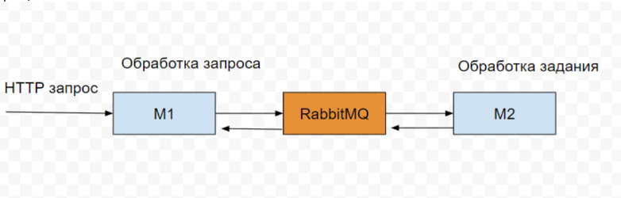

## Это тестовое задание на позицию "Разработчик NodeJS", а для меня ещё и возможность поработать с RabbitMQ

Требования:
1. Требуется разработать механизм асинхронной обработки HTTP запросов
2. Требуется использовать стек NodeJS, RabbitMQ
3. Требуется оформить в виде репозитория на Github
4. Требуется приложить инструкцию по локальному развертыванию проекта
5. Требуется реализовать логирование для целей отладки и мониторинга
6. Требуется разработать микросервис М1 для обработки входящих HTTP запросов
7. Требуется разработать микросервис М2 для обработки заданий из RabbitMQ

## Алгоритм работы:
+ Получаем HTTP запрос на уровне микросервиса М1.
+ Транслируем HTTP запрос в очередь RabbitMQ. Запрос трансформируется в задание.
+ Обрабатываем задание микросервисом М2 из очереди RabbitMQ.
+ Помещаем результат обработки задания в RabbitMQ.
+ Возвращаем результат HTTP запроса как результат выполнения задания из RabbitMQ.

## Что мы имеем:
+ HTTP запрос мы получаем из index.html открытого в браузере (находится в папке public)
+ Микросервис М1 представлен двумя файлами, app.js и rpc_client.js
+ app.js принимает HTTP запрос, обрабатывает его и вызывает функцию rmqPub
+ В rpc_client.js находится логика работы М1 с RabbitMQ, в частности функция rmqPub, которая создаёт задачу в RabbitMQ (ещё эта функция принимает ответ)
+ Микросервис М2 представлен файлом rpc_server.js
+ rpc_server.js принимает задачу из RabbitMQ, обрабатывает входные данные и отправляет отбратно в через RabbitMQ
+ M1 rpc_client.js принимает данные из RabbitMQ отправленные M2 rpc_server.js

## Как запустить проект?
1. Нам понадобится локальный сервер RabbitMQ
2. Для этого скачиваем и устанавливаем  [Erlang](https://www.erlang.org/downloads) 
3. Так же сам сервер [RabbitMQ](https://www.rabbitmq.com/install-windows.html)
4. Перезагружаем ПК
5. Вызываем командную строку RabbitMQ и выполняем команды
   + rabbitmq-server –detached  (запуск сервера)
   + rabbitmq-plugins enable rabbitmq_management  (включение плагинов)
6. Открываем веб интерфейc локального сервера RabbitMQ [http://localhost:15672/](http://localhost:15672/)
   + user guest
   + password guest
7. Запускаем наш локальный сервер для HTTP запросов
    + Вызываем CMD и в директории проекта выполняем команду node app.js
8. Запускаем обработчик заданий RabbitMQ
    + Вызываем CMD и в директории проекта выполняем команду node rpc_server.js
9. Открываем веб интерфейс нашего локального сервера [http://localhost:3000/](http://localhost:3000/)
    + Добавление, изменение, удаление пользователей тригерит HTTP запросы
10. [Видеоинстукция](https://youtu.be/xitivW08DUM)

